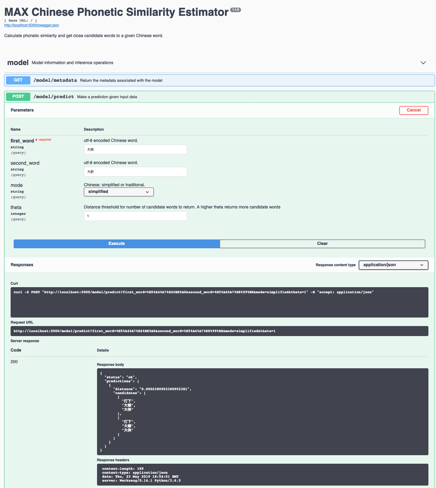

[](https://travis-ci.com/IBM/MAX-Chinese-Phonetic-Similarity-Estimator) [](http://max-chinese-phonetic-similarity-estimator.max.us-south.containers.appdomain.cloud/)

[](http://ibm.biz/max-to-ibm-cloud-tutorial) 

# IBM Developer Model Asset Exchange: Chinese Phonetic Similarity Estimator

This repository contains code to instantiate and deploy a Chinese Phonetic Similarity Estimator. The model provides a phonetic algorithm for indexing Chinese characters by sound. Given two Chinese words of the same length, the model determines the distances between the two words and also returns a few candidate words which are close to the given word(s). The code complies with the phonetic principles of Mandarin Chinese as guided by the Romanization defined in [ISO 7098:2015](https://www.iso.org/standard/61420.html).

The model is based on the [DimSim model](https://github.com/System-T/DimSim).
The code in this repository deploys the model as a web service in a Docker container. This repository was developed
as part of the [IBM Developer Model Asset Exchange](https://developer.ibm.com/exchanges/models/) and the public API is powered by [IBM Cloud](https://ibm.biz/Bdz2XM).

## Model Metadata
| Domain | Application | Industry  | Framework | Training Data | Input Data Format |
| ------------- | --------  | -------- | --------- | --------- | -------------- | 
| NLP | Text Clustering/Phonetics | Social Media | Python | N/A | Chinese Text (utf-8 encoded) |

## References

* _ALi, Min and Danilevsky, Marina and Noeman, Sara and Li, Yunyao_, ["DIMSIM: An Accurate Chinese Phonetic Similarity Algorithm Based on Learned High Dimensional Encoding"](http://aclweb.org/anthology/K18-1043), Proceedings of the 22nd Conference on Computational Natural Language Learning, 2018.
* [DimSim GitHub Repo](https://github.com/System-T/DimSim)

## Licenses

| Component | License | Link  |
| ------------- | --------  | -------- |
| This repository | [Apache 2.0](https://www.apache.org/licenses/LICENSE-2.0) | [LICENSE](LICENSE) |
| Model Weights | N/A | N/A |
| Model Code (3rd party) | [Apache 2.0](https://www.apache.org/licenses/LICENSE-2.0) | [LICENSE](https://github.com/System-T/DimSim/blob/master/LICENSE) |
| Test Samples | N/A | N/A |

## Pre-requisites:

* `docker`: The [Docker](https://www.docker.com/) command-line interface. Follow the [installation instructions](https://docs.docker.com/install/) for your system.
* The minimum recommended resources for this model is 4 GB Memory and 4 CPUs.

# Steps

1. [Run using PyPi](#run-using-pypi)
2. [Deploy from Docker Hub](#deploy-from-docker-hub)
3. [Deploy on Kubernetes](#deploy-on-kubernetes)
4. [Run Locally](#run-locally)

## Run using PyPi
### Installing the library
**Dependencies**:
- [pypinyin](https://github.com/mozillazg/python-pinyin): used for translating Chinese characters into their correponding pinyins. 

There are two ways to install this library:
- Install from PyPi

```shell
pip install dimsim
```
- Download the source code by cloning the source repo and compile it yourself.

```shell
git clone git@github.com:System-T/DimSim.git

cd DimSim/

pip install -e .
```

### How to use the library
Once you have the package installed you can use it for the two functions as shown below.

- Computing phonetic distance of two Chinese phrases. The optional argument `pinyin` (False by default) can be used to provide a pinyin string list directly. See example usage below.

```python
import dimsim

dist = dimsim.get_distance("大侠","大虾")
0.0002380952380952381

dist = dimsim.get_distance("大侠","大人")
25.001417183349876

dist = dimsim.get_distance(['da4','xia2'],['da4','xia1']], pinyin=True)
0.0002380952380952381

dist = dimsim.get_distance(['da4','xia2'],['da4','ren2']], pinyin=True)
25.001417183349876

```
***
- Return top-k phonetically similar phrases of a given Chinese phrase. Two parameters:
- **mode** controls the character type of the returned Chinese phrases, where 'simplified' represents simplified Chinese and 'traditional' represents traditional Chinese.
- **theta** controls the size of search space for the candidate phrases.
```python
import dimsim

candidates = dimsim.get_candidates("大侠", mode="simplified", theta=1)
['打下', '大虾', '大侠']

candidates = dimsim.get_candidates("粉丝", mode="traditional", theta=1)
['門市', '分時', '焚屍', '粉飾', '粉絲']
```


## Deploy from Docker Hub

To run the docker image, which automatically starts the model serving API, run:

```
$ docker run -it -p 5000:5000 codait/max-chinese-phonetic-similarity-estimator
```

This will pull a pre-built image from Docker Hub (or use an existing image if already cached locally) and run it.
If you'd rather checkout and build the model locally you can follow the [run locally](#run-locally) steps below.

## Deploy on Kubernetes

You can also deploy the model on Kubernetes using the latest docker image on Docker Hub.

On your Kubernetes cluster, run the following commands:

```
$ kubectl apply -f https://github.com/IBM/MAX-Chinese-Phonetic-Similarity-Estimator/raw/master/max-chinese-phonetic-similarity-estimator.yaml
```

The model will be available internally at port `5000`, but can also be accessed externally through the `NodePort`.

A more elaborate tutorial on how to deploy this MAX model to production on [IBM Cloud](https://ibm.biz/Bdz2XM) can be found [here](http://ibm.biz/max-to-ibm-cloud-tutorial). 

## Run Locally

1. [Build the Model](#1-build-the-model)
2. [Deploy the Model](#2-deploy-the-model)
3. [Use the Model](#3-use-the-model)
4. [Development](#4-development)
5. [Cleanup](#5-cleanup)


### 1. Build the Model

Clone this repository locally. In a terminal, run the following command:

```
$ git clone https://github.com/IBM/MAX-Chinese-Phonetic-Similarity-Estimator.git
```

Change directory into the repository base folder:

```
$ cd MAX-Chinese-Phonetic-Similarity-Estimator
```

To build the docker image locally, run: 

```
$ docker build -t max-chinese-phonetic-similarity-estimator .
```

All required model assets will be downloaded during the build process. _Note_ that currently this docker image is CPU only (we will add support for GPU images later).


### 2. Deploy the Model

To run the docker image, which automatically starts the model serving API, run:

```
$ docker run -it -p 5000:5000 max-chinese-phonetic-similarity-estimator
```

### 3. Use the Model

The API server automatically generates an interactive Swagger documentation page. Go to `http://localhost:5000` to load it. From there you can explore the API and also create test requests.

Use the `model/predict` endpoint to pass the input to the model. The input has one required field - `first_word`. 
The other inputs are optional. Providing a `second_word` would return distance between the `first_word` and `second_word`, in addition to the closest candidate words to both of them.

Other optional arguments are:
`theta` -  indicates the distance threshold for candidate words and controls the size of search space for the candidate words. Higher theta returns more candidate words. Default is `1`.
`mode`  - indicates the output type of the Chinese characters - `traditional` or `simplified`. Default is `simplified`.




You can also test it on the command line, for example:

```
$ curl -X POST "http://localhost:5000/model/predict?first_word=%E5%A4%A7%E8%99%BE&second_word=%E5%A4%A7%E4%BE%A0&mode=simplified&theta=1" -H  "accept: application/json"
```

You should see a JSON response like that below:

```json
{
  "status": "ok",
  "predictions": [
    {
      "distance": "0.0002380952380952381",
      "candidates": [
        [
          "打下",
          "大虾",
          "大侠"
        ],
        [
          "打下",
          "大虾",
          "大侠"
        ]
      ]
    }
  ]
}
```

This means the given words had a distance of 0.00024 between them, and they can be inferred to be very close. The candidate words contains list of candidate words.

### 4. Development

To run the Flask API app in debug mode, edit `config.py` to set `DEBUG = True` under the application settings. You will then need to rebuild the docker image (see [step 1](#1-build-the-model)).

### 5. Cleanup

To stop the Docker container, type `CTRL` + `C` in your terminal.

